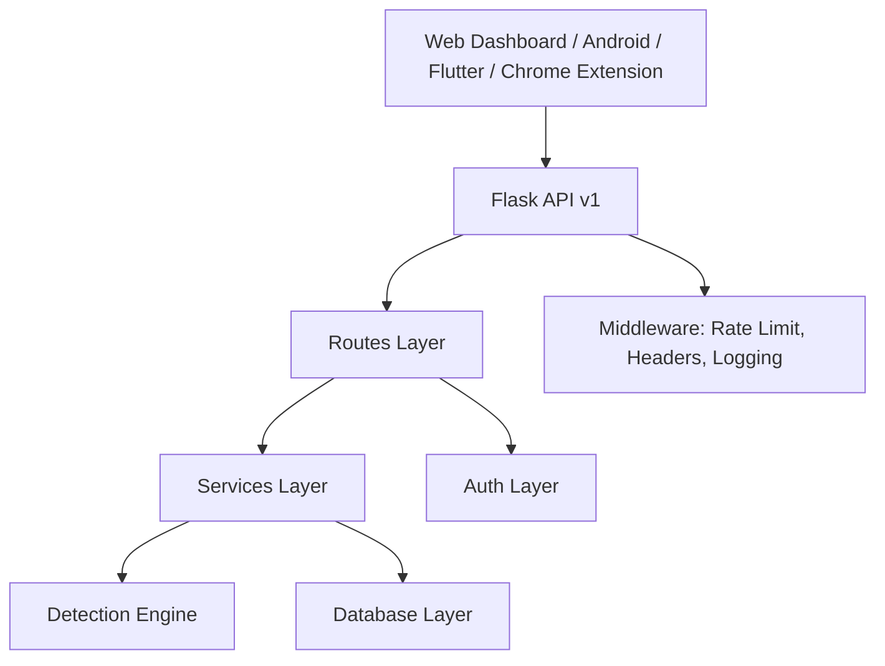

# PhishGuard Architecture

PhishGuard uses route modules for HTTP contracts, services for business logic, a detection engine for URL intelligence, and SQLite for development persistence. The API is versioned under `/api/v1` for Android and Flutter clients.
